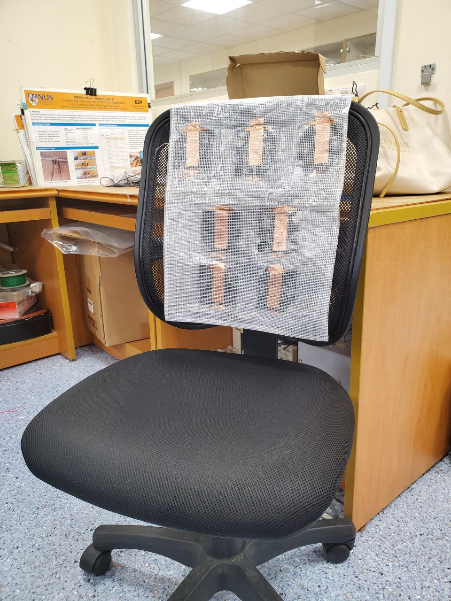
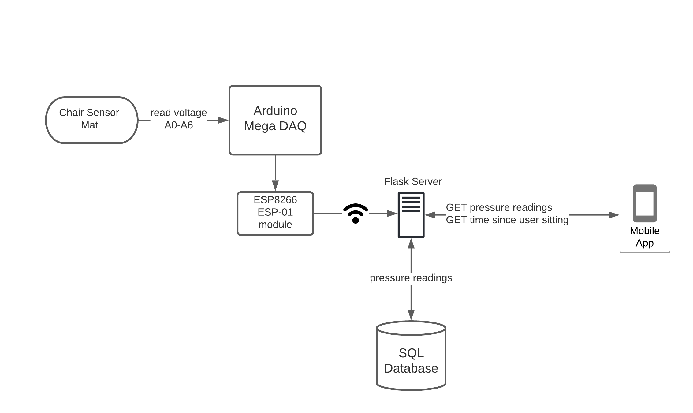
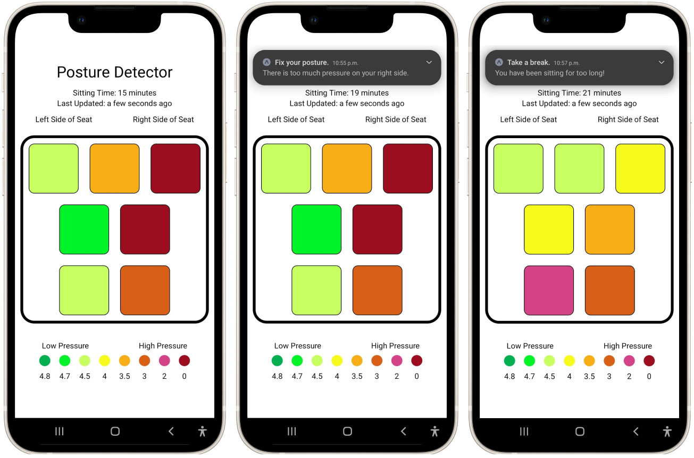

# posture-detector

Arduino, server and mobile application code for a posture-detecting sensor mat. A sensor mat equipped with custom force-sensitive resistors (velostat sensors) is placed on the back of a chair. The voltage across each of the resistors is measured by an Arduino Mega. The readings are then sent to a Flask server using an ESP8266 ESP-01 Wi-Fi module. The pressure distribution is then saved to a PostgreSQL database. The measured voltage has an inverse relationship to the pressure applied to the sensor.

The mobile application periodically polls the server, and reflects changes in pressure distribution in the application interface. Should the user be detected to have improper posture, or if the user has been sitting for too long in the chair, a push notification is sent to the user's device.

